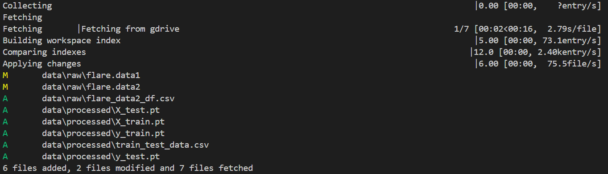

## Procedimiento para ejecutar DVC
1)Descargar el archivo de **flare-mlops###.json** y agregarlo a la carpeta de **.dvc** dentro del repositorio del equipo. Abajo hemos compartido la liga de donde se puede encontrar el documento.

[flare-mlops###.json](https://drive.google.com/drive/u/0/folders/1mkQ8S6jGSXLvUi7F0CDQlCiItCGLsdxj)

2)Antes de ejecutar el comando que se muestra a continuación, debemos ajustar la ruta del archivo **{root content .json file path}** destacada, configurándola con la ruta relativa donde se guardó el archivo JSON anterior. Si encuentras algún error, asegúrate de eliminar cualquier **../** que pueda haberse agregado en la ruta.

```
dvc remote modify remote-storage --local  gdrive_service_account_json_file_path **{root content .json file path}**
```

3)Dentro del archivo **config.local** terminaría viendose como algo:

```
['remote "remote-storage"']
    gdrive_service_account_json_file_path = <nombre completo flare-mlops###.json>
```

4)Si el módulo 'gdrive' no está instalado, entonces ejecutamos **pip3 install dvc[gdrive]** 

5)Ejecuta **dvc pull**. Hemos añadido una captura de pantalla que muestra el resultado al ejecutar dvc pull en nuestro repositorio, donde se puede ver cómo se descargan los archivos de datos y artefactos de modelo desde el almacenamiento remoto a nuestra máquina local.




5)Ejecutar **dvc repro**. Si tienes problemas al ejecutar el comando dvc repro, asegúrate de estar utilizando Python3. A continuación, hemos proporcionado algunas instrucciones sobre cómo migrar a Python3.


